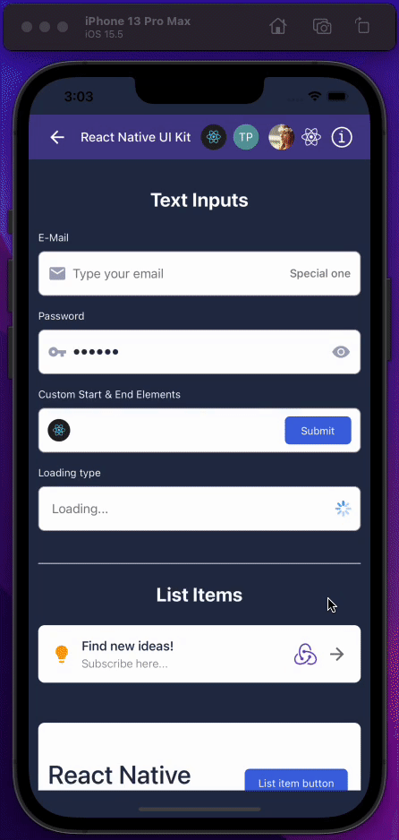
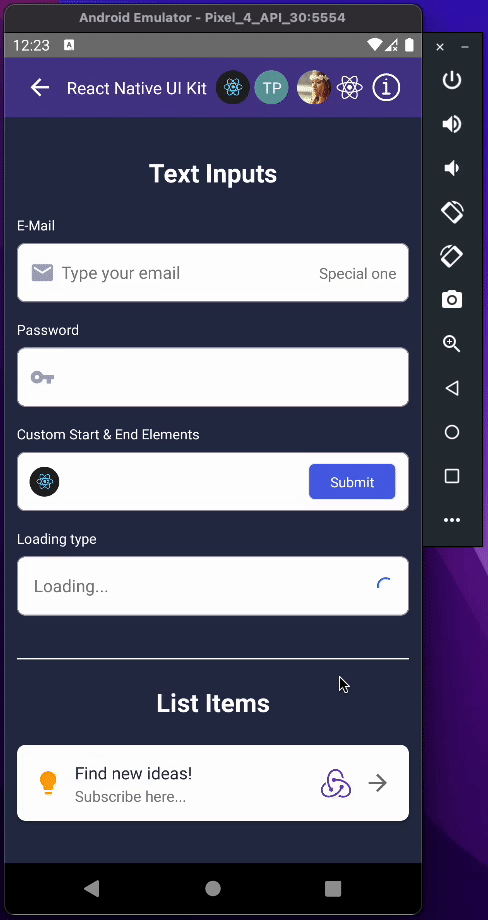

<div align="center"><h1>React Native UI Kit</h1></div> 

<div align="center">

[](https://www.npmjs.com/package/@tarikfp/react-native-ui-kit) [](https://www.npmjs.com/package/@tarikfp/react-native-ui-kit) [](https://github.com/tarikpnr/react-native-ui-kit/blob/master/LICENSE)
 
 </div>


<br/>
<div align="center">This library consists of a small set of components that are highly flexible, extensively tested and commonly used when building any kind of react native app. Written in typescript.
</div>

<br/>


<div align="center">
  
  &nbsp;
  &nbsp;
  

</div>

## Table of contents

*  [Installing](#installing)
*  [Components](#components)
*  [Contributing](#contributing)
*  [License](#license)

    
    

## Installing

Install dependencies

```bash
  yarn add @tarikfp/react-native-ui-kit
```

or

```bash
  npm install @tarikfp/react-native-ui-kit
```

### Install react-native-vector-icons
This project uses the [react-native-vector-icons](https://github.com/oblador/react-native-vector-icons) library.
Ensure to install it prior to running the project to avoid any unexpected errors.

## Components

### Button

A button is component that the user can press to trigger an action.

#### Properties

Inherits [TouchableOpacity props](https://reactnative.dev/docs/touchableopacity#props) and the following:

| Prop                  | Type                                                                           | Description                                                                                            |
| --------------------- | ------------------------------------------------------------------------------ | ------------------------------------------------------------------------------------------------------ |
| **`size`**            | `string`                                                                       | Size of the button. Can be one of the following: `large`, `medium`, `small`, `xsmall`                  |
| **`loading`**         | `boolean`                                                                      | Whether button is in loading state. Loading indicator will be shown next to the label in case of true. |
| **`labelStyle`**      | `StyleProp<TextStyle>`                                                         | Button label style.                                                                                    |
| **`label`**           | `string`                                                                       | Label of the button.                                                                                   |
| **`backgroundColor`** | `string`                                                                       | Background color of the button.                                                                        |
| **`startIcon`**       | `IconProps`                                                                    | Props of the icon which will be displayed start of the button.                                         |
| **`endIcon`**         | `IconProps`                                                                    | Props of the icon which will be displayed end of the button.                                           |
| **`loadingProps`**    | [ActivityIndicatorProps](https://reactnative.dev/docs/activityindicator#props) | Props of the loading indicator.                                                                        |

#### Usage

```js
import { Button } from "@tarikfp/react-native-ui-kit";

return (
  <Button
    size="xsmall"
    backgroundColor="royalblue"
    label="Start recording"
    startIcon={{
      name: "microphone",
      type: "FontAwesome",
      color: "white",
    }}
  />
);
```

### Avatar

Avatars represent a user and can contain photos, icons, or even text.

#### Avatar Icon

Avatar with icon. This component uses [react-native-vector-icons](https://github.com/oblador/react-native-vector-icons) under the hood.

| Prop                  | Type                   | Description                                                                                        |
| --------------------- | ---------------------- | -------------------------------------------------------------------------------------------------- |
| **`size`**            | `number`               | Size of the avatar. Default `32`                                                                   |
| **`backgroundColor`** | `string`               | Background color of the avatar.                                                                    |
| **`style`**           | `StyleProp<ViewStyle>` | Style of the avatar.                                                                               |
| **`name`**            | `string`               | Name of the icon.                                                                                  |
| **`type`**            | `string`               | Type of the icon. [See available icon types](https://oblador.github.io/react-native-vector-icons/) |
| **`color`**           | `string`               | Color of the icon.                                                                                 |
| **`iconProps`**       | `IconProps`            | Props of the icon.                                                                                 |

#### Avatar Icon usage

```js
import { Avatar } from "@tarikfp/react-native-ui-kit";

return (
  <Avatar.Icon color="dodgerblue" size={65} name="react" type="Fontisto" />
);
```

#### Avatar Image

Inheirts [Image props](https://reactnative.dev/docs/image#props) and the following.

| Prop                  | Type                                                                  | Description                                                      |
| --------------------- | --------------------------------------------------------------------- | ---------------------------------------------------------------- |
| **`size`**            | `number`                                                              | Size of the avatar. Default `32`                                 |
| **`source`**          | [ImageSourcePropType](https://reactnative.dev/docs/image#imagesource) | The image source (either a remote URL or a local file resource). |
| **`backgroundColor`** | `string`                                                              | Background color of the avatar.                                  |
| **`style`**           | `StyleProp<ViewStyle>`                                                | Style of the image wrapper.                                      |
| **`imageStyle`**      | `StyleProp<ImageStyle>`                                               | Style of the image.                                              |

#### Avatar Image usage

```js
import { Avatar } from "@tarikfp/react-native-ui-kit";

return (
  <Avatar.Image
    size={65}
    source={{ uri: "https://reactnative.dev/img/logo-og.png" }}
  />
);
```

#### Avatar Text

Avatar with text component.

| Prop                  | Type                   | Description                        |
| --------------------- | ---------------------- | ---------------------------------- |
| **`size`**            | `number`               | Size of the avatar. Default `32`   |
| **`label`**           | `string`               | Text to display on avatar.         |
| **`backgroundColor`** | `string`               | Background color of the avatar.    |
| **`labelColor`**      | `string`               | Color of the avatar label.         |
| **`style`**           | `StyleProp<ViewStyle>` | Style of the avatar label wrapper. |
| **`labelStyle`**      | `StyleProp<TextStyle>` | Style of the label.                |

#### Avatar Text usage

```js
import { Avatar } from "@tarikfp/react-native-ui-kit";

return <Avatar.Text backgroundColor="darkorange" size={65} label="TP" />;
```

### Header

Headers are the components that display information and actions for the current screen.

#### Properties

Inherits [View props](https://reactnative.dev/docs/view#props) and the following:

| Prop                  | Type                   | Description                                                             |
| --------------------- | ---------------------- | ----------------------------------------------------------------------- |
| **`height`**          | `number`               | Height of the header component. Defaults to `56`.                       |
| **`hasShadow`**       | `boolean`              | Whether header has the shadow style applied or not. Defaults to `false` |
| **`backgroundColor`** | `string`               | Background color of the header.                                         |
| **`style`**           | `StyleProp<ViewStyle>` | Style of the header.                                                    |

#### Usage

```js
import { Header } from "@tarikfp/react-native-ui-kit";

return (
  <Header>
    <Header.Title label="Home screen" />
    <Header.Image
      source={{
        uri: "https://reactnative.dev/img/logo-og.png",
      }}
    />
    <Header.Icon
      alignment="end"
      name="arrow-right"
      type="MaterialCommunityIcons"
    />
  </Header>
);
```

#### Header Icon

Header icon element. This component uses [react-native-vector-icons](https://github.com/oblador/react-native-vector-icons) under the hood.

#### Properties

Inherits `IconProps` and the following:

| Prop               | Type                   | Description                                                                  |
| ------------------ | ---------------------- | ---------------------------------------------------------------------------- |
| **`style`**        | `StyleProp<TextStyle>` | Style of the icon.                                                           |
| **`wrapperStyle`** | `StyleProp<ViewStyle>` | Style of the icon wrapper.                                                   |
| **`alignment`**    | `string`               | Alignment of the icon component. Can be one of the following: `start`, `end` |

#### Header Icon usage

```js
import { Header } from "@tarikfp/react-native-ui-kit";

return (
  <Header height={72}>
    <Header.Icon name="arrow-left" type="MaterialCommunityIcons" />
  </Header>
);
```

#### Header Image

Header image element.

#### Properties

Inherits [Image props](https://reactnative.dev/docs/image#props) and the following:

| Prop        | Type                   | Description         |
| ----------- | ---------------------- | ------------------- |
| **`style`** | `StyleProp<ViewStyle>` | Style of the image. |

#### Header Image usage

```js
import { Header } from "@tarikfp/react-native-ui-kit";

return (
  <Header>
    <Header.Image
      source={{
        uri: "https://reactnative.dev/img/logo-og.png",
      }}
    />
  </Header>
);
```

#### Header Title

Header title element.

#### Properties

Inherits [Text props](https://reactnative.dev/docs/text#props) and the following:

| Prop                | Type                   | Description                 |
| ------------------- | ---------------------- | --------------------------- |
| **`title`**         | `string`               | Title text.                 |
| **`subtitle`**      | `string`               | Subtitle text.              |
| **`subtitleStyle`** | `StyleProp<TextStyle>` | Style of the subtitle text. |
| **`style`**         | `StyleProp<TextStyle>` | Style of the title text.    |
| **`wrapperStyle`**  | `StyleProp<ViewStyle>` | Style of the wrapper view.  |

#### Header Title usage

```js
import { Header } from "@tarikfp/react-native-ui-kit";

return (
  <Header>
    <Header.Title title="Home screen" />
  </Header>
);
```

### Text Input

Text Input is a component for inputting text into the app via a keyboard.

#### Properties

Inherits [TextInput props](https://reactnative.dev/docs/textinput#props) and the following:

| Prop                        | Type                    | Description                                                                                                                                                                               |
| --------------------------- | ----------------------- | ----------------------------------------------------------------------------------------------------------------------------------------------------------------------------------------- |
| **`isPassword`**            | `boolean`               | Whether the text input is password type. Toggling [secureTextEntry](https://reactnative.dev/docs/textinput#securetextentry) with icon will be shown at the end of input in case of `true` |
| **`backgroundColor`**       | `string`                | Background color of text input.                                                                                                                                                           |
| **`inputStyle`**            | `StyleProp<TextStyle>`  | Style of the input.                                                                                                                                                                       |
| **`wrapperStyle`**          | `StyleProp<ViewStyle>`  | Style of the text input wrapper.                                                                                                                                                          |
| **`label`**                 | `string`                | Label to display above input.                                                                                                                                                             |
| **`errorMessage`**          | `string`                | Error message text to display below input.                                                                                                                                                |
| **`errorMessageIconProps`** | `IconProps`             | Error message icon props.                                                                                                                                                                 |
| **`startIcon`**             | `IconProps`             | Props of the icon which will be displayed start of the input.                                                                                                                             |
| **`endIcon`**               | `IconProps`             | Props of the icon which will be displayed end of the input.                                                                                                                               |
| **`renderStartElement`**    | `() => React.ReactNode` | Callback function that returns `React` element(s) to be displayed on the start of the input. Overrides `startIcon` prop.                                                                  |
| **`renderEndElement`**      | `() => React.ReactNode` | Callback function that returns `React` element(s) to be displayed on the end of the input. Overrides `endIcon` prop.                                                                      |
| **`renderInput`**           | `() => React.ReactNode` | Callback function that returns `React` element(s) which will replace the default input.                                                                                                   |
| **`endText`**               | `string`                | Text which will be displayed on the end of the input.                                                                                                                                     |
| **`endTextStyle`**          | `StyleProp<TextStyle>`  | End text style.                                                                                                                                                                           |
| **`loading`**               | `boolean`               | Indicates whether input is in loading state. Loading indicator will be displayed at the end of the input.                                                                                 |
| **`loadingProps`**          | `boolean`               | Indicates whether input is in loading state. Loading indicator will be displayed at the end of the input.                                                                                 |
| **`renderLoading`**         | `() => React.ReactNode` | Renders loading section of the input.                                                                                                                                                     |
| **`renderPasswordIcon`**    | `() => React.ReactNode` | Renders custom password icon while overriding default one. `isPassword` must be set to true.                                                                                              |
| **`disabled`**              | `boolean`               | Whether all interactions are disabled in the input.                                                                                                                                       |
| **`hideDefaultEndIcons`**   | `boolean`               | Hides default end icons for password and text type input. Defaults to `false` (Close icon for text and eye icon for password input)                                                       |
| **`height`**                | `number`                | Height of the input. Defaults to `56`                                                                                                                                                     |
| **`borderRadius`**          | `number`                | Border radius of the input. Defaults to `8`                                                                                                                                               |
| **`borderColor`**           | `string`                | Border color of the input. Defaults to `8`                                                                                                                                                |
| **`labelStyle`**            | `StyleProp<TextStyle>`  | Input text style.                                                                                                                                                                         |
| **`errorColor`**            | `string`                | Color of the error which will be applied to the input border, error icon and text.                                                                                                        |
| **`renderErrorSection`**    | `() => React.ReactNode` | Callback function that returns `React` element(s) to be displayed on the error section of the input.                                                                                      |

#### Usage

```js
import { TextInput } from "@tarikfp/react-native-ui-kit";

return (
  <TextInput
    wrapperStyle={{ marginBottom: 16 }}
    label="E-Mail"
    labelStyle={{ color: "#FFFFFF" }}
    endText="Special one"
    endTextStyle={{ color: "grey" }}
    placeholder="Type your email"
    placeholderTextColor="grey"
    startIcon={{ type: "MaterialCommunityIcons", name: "email" }}
    value={email}
    onChangeText={setEmail}
  />
);

// Display custom password icon

return (
  <TextInput
    isPassword
    renderPasswordIcon={({ isSecureTextEntry, toggleSecureTextEntry }) =>
      isSecureTextEntry ? (
        <Icon onPress={toggleSecureTextEntry} name="eye" type="Feather" />
      ) : (
        <Icon onPress={toggleSecureTextEntry} name="eye-off" type="Feather" />
      )
    }
  />
);

// Display custom loading section

return (
  <TextInput
    loading
    renderLoading={(containerStyle) => (
      // inject computed container style
      <View style={[containerStyle, myStyle]}>
        <Text>Loading...</Text>
      </View>
    )}
  />
);

// Display custom start element

return (
  <TextInput
    renderStartElement={() => (
      <View>
        <Image
          style={{ width: 30, height: 30 }}
          source={{
            uri: "customImageUrl",
          }}
        />
      </View>
    )}
  />
);
```

### List Item

List items are used to display rows of information, they are extremely flexible and can contain almost anything.

#### Properties

Inherits [TouchableOpacity props](https://reactnative.dev/docs/touchableopacity#props) and the following:

| Prop                  | Type                   | Description                                                                |
| --------------------- | ---------------------- | -------------------------------------------------------------------------- |
| **`height`**          | `number`               | Height of the list item component. Defaults to `56`.                       |
| **`hasShadow`**       | `boolean`              | Whether list item has the shadow style applied or not. Defaults to `false` |
| **`backgroundColor`** | `string`               | Background color of the list item.                                         |
| **`style`**           | `StyleProp<ViewStyle>` | Style of the list item.                                                    |

#### Usage

```js
import { ListItem } from "@tarikfp/react-native-ui-kit";

return (
  <ListItem style={{ marginTop: 50 }} hasShadow height={150}>
    <ListItem.Title
      title="React Native"
      style={{ fontSize: 32, lineHeight: 55, fontWeight: "500" }}
      subtitle="Flexible list item..."
      subtitleStyle={{ fontWeight: "300", color: "grey" }}
    />
    <ListItem.Button
      alignment="end"
      backgroundColor="royalblue"
      size="xsmall"
      label="List item button"
    />
  </ListItem>
);
```

#### List Item Icon

List Item icon element. This component uses [react-native-vector-icons](https://github.com/oblador/react-native-vector-icons) under the hood.

#### Properties

Inherits `IconProps` and the following:

| Prop               | Type                   | Description                                                                  |
| ------------------ | ---------------------- | ---------------------------------------------------------------------------- |
| **`style`**        | `StyleProp<ViewStyle>` | Style of the icon.                                                           |
| **`wrapperStyle`** | `StyleProp<ViewStyle>` | Style of the icon wrapper.                                                   |
| **`alignment`**    | `string`               | Alignment of the icon component. Can be one of the following: `start`, `end` |

#### List Item Icon usage

```js
import { ListItem } from "@tarikfp/react-native-ui-kit";

return (
  <ListItem>
    <ListItem.Icon
      name="lightbulb"
      type="MaterialCommunityIcons"
      color="orange"
    />
  </ListItem>
);
```

#### List Item Image

List Item image element.

#### Properties

Inherits [Image props](https://reactnative.dev/docs/image#props) and the following:

| Prop        | Type                   | Description         |
| ----------- | ---------------------- | ------------------- |
| **`style`** | `StyleProp<ViewStyle>` | Style of the image. |

#### List Item Image usage

```js
import { ListItem } from "@tarikfp/react-native-ui-kit";

return (
  <ListItem>
    <ListItem.Image
      style={{ width: 50, height: 50 }}
      source={{
        uri: "https://reactnative.dev/img/logo-og.png",
      }}
    />
  </ListItem>
);
```

#### List Item Title

List Item title element.

#### Properties

Inherits [Text props](https://reactnative.dev/docs/text#props) and the following:

| Prop                | Type                   | Description                 |
| ------------------- | ---------------------- | --------------------------- |
| **`title`**         | `string`               | Title text.                 |
| **`subtitle`**      | `string`               | Subtitle text.              |
| **`subtitleStyle`** | `StyleProp<TextStyle>` | Style of the subtitle text. |
| **`style`**         | `StyleProp<TextStyle>` | Style of the title text.    |
| **`wrapperStyle`**  | `StyleProp<ViewStyle>` | Style of the wrapper view.  |

#### List Item Title usage

```js
import { ListItem } from "@tarikfp/react-native-ui-kit";

return (
  <ListItem>
    <ListItem.Title
      title="Find new ideas!"
      subtitle="Subscribe here..."
      subtitleStyle={{ fontWeight: "300", color: "grey" }}
    />
  </ListItem>
);
```

#### List Item Button

List Item button element.

#### Properties

Inherits [Button props](https://reactnative.dev/docs/text#props) and the following:

| Prop               | Type                   | Description                                                                  |
| ------------------ | ---------------------- | ---------------------------------------------------------------------------- |
| **`wrapperStyle`** | `StyleProp<ViewStyle>` | Style of the button wrapper.                                                 |
| **`alignment`**    | `string`               | Alignment of the icon component. Can be one of the following: `start`, `end` |

#### List Item Button usage

```js
import { ListItem } from "@tarikfp/react-native-ui-kit";

return (
  <ListItem hasShadow height={150}>
    <ListItem.Button
      alignment="end"
      backgroundColor="royalblue"
      size="xsmall"
      label="List item button"
    />
  </ListItem>
);
```

## Contributing
The main purpose of this library is to provide reusable, bug-free, and flexible components along with documentation. Contributors are always highly appreciated to keep this library maintained and enhance it more.

## License

MIT
